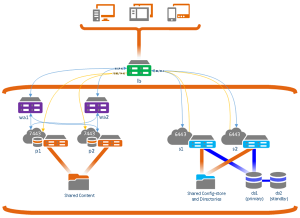

# ArcGIS Portal HA Roles
## Architecture

## TODO
- [x] ArcGIS Portal Primary
- [x] ArcGIS Portal Secondary
- [x] ArcGIS Server Primary
- [x] ArcGIS Server Secondary
- [x] ArcGIS DateStore Primary
- [ ] ArcGIS DateStore Secondary
- [x] ArcGIS WebAdaptor Primary
- [x] ArcGIS WebAdaptor Secondary
- [ ] ArcGIS ImageHosting Primary
- [ ] ArcGIS ImageHosting Secondary
- [ ] ArcGIS ImageAnalysis Primary
- [ ] ArcGIS ImageAnalysis Secondary
- [ ] ArcGIS EGDB (SDE) Primary
- [ ] ArcGIS EGDB (SDE) Secondary
- [ ] ArcGIS Federation
- [ ] ArcGIS FileServer - do not need - we use ISCSI.